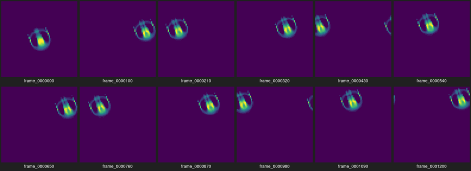
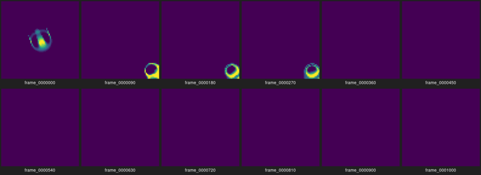
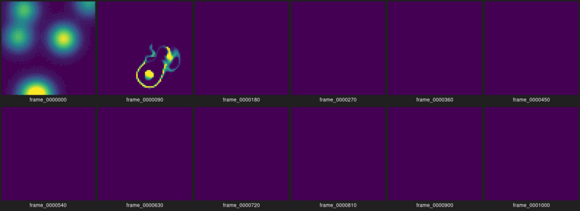
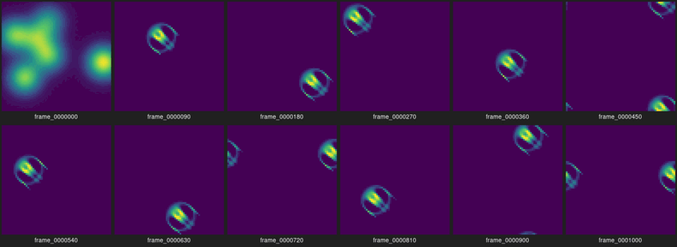
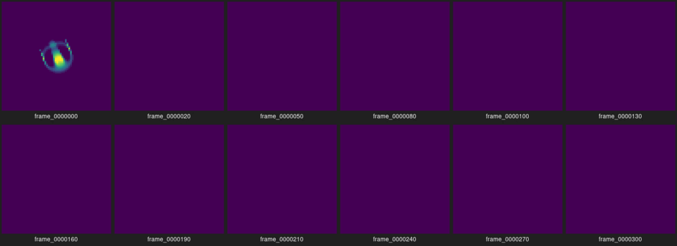
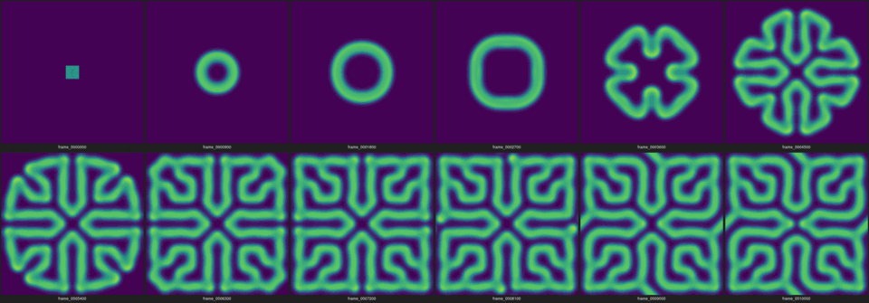
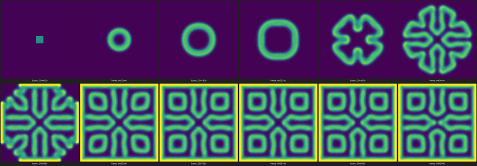
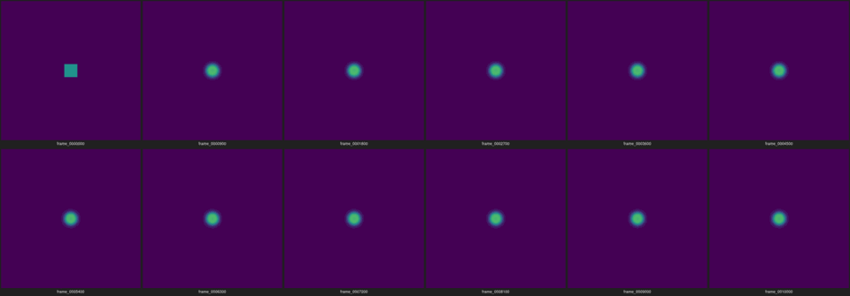
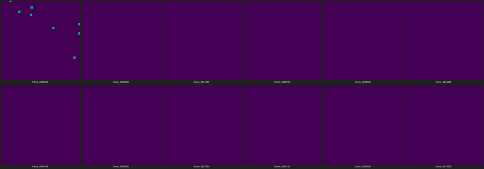
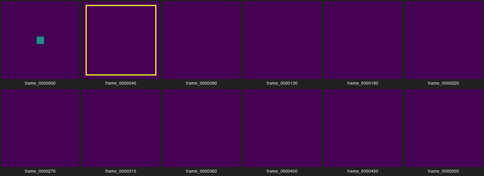

# Phase 0 — 実験レポート

**読者:** 本人(制作者)。
**役割:** Phase 0 の完了報告。本人がこれを読み、Phase 1 に進むか、Phase 0 を続けるか、保留するかを判断する。様式は [.claude/skills/phase-report/SKILL.md](../../.claude/skills/phase-report/SKILL.md)。
**日付:** 2026-09-24

## 1. 実行方法

- 環境: Ubuntu 24.04 (exe.dev VM, x86_64, 2 コア, 7.8 GB)、g++ 13.3.0、CMake 3.28.3。依存ライブラリなし。動画・シート生成のみ ffmpeg 6.1.1 と ImageMagick 6 (`montage`, `convert`)。
- ブランチ `phase-0-model-exploration`、実験時のコミット **1b528da**(全 `config.json` の `code_version` に記録)。
- ビルドとテスト:

```bash
cmake -S . -B build -DCMAKE_BUILD_TYPE=Release && cmake --build build -j
(cd build && ctest --output-on-failure)   # 6/6 passed
```

- 実験の再現(全 17 本の正確なコマンドは付録 A):

```bash
./build/cave --model lenia --preset orbium --init orbium --width 64 --height 64 --steps 1000 --every 10 --out experiments/out/L1_orbium_periodic
scripts/make_media.sh experiments/out/L1_orbium_periodic
```

## 2. 変更範囲

| ファイル | 内容 |
| --- | --- |
| `src/core/grid.*` | `std::vector<float>` を所有する 2D 格子。`index = y*W + x`。周期/固定境界の読み出し |
| `src/core/model.*` | モデル共通インターフェース(`step`, `channels`, `save_state`)とチェックポイント I/O |
| `src/core/lenia.*`, `orbium_cells.hpp` | Lenia 型連続 CA。Orbium 初期配置は原作者の `animals.json` からデコード |
| `src/core/gray_scott.*` | Gray–Scott 反応拡散(u, v) |
| `src/core/metrics.*` | min/max/総量/前スナップショットとの L1 差分/閾値超えセル数/有限性、健全性フラグ |
| `src/core/presets.*` | プリセット(パラメータ)と初期条件 |
| `src/io/png.*`, `colormap.*` | 依存なし PNG 書き出し、viridis/gray カラーマップ、最近傍拡大 |
| `src/app/main.cpp` | CLI。`config.json`, `metrics.csv`, `frames/*.png`, `state.bin`, `summary.txt` を出力 |
| `tests/` | 6 本(境界、Lenia カーネル/成長、Gray–Scott ラプラシアン/静止状態、指標、PNG、決定性) |
| `scripts/make_media.sh` | フレーム → mp4 とラベル付きシート |
| `docs/decisions/0002_*` | Phase 0 は headless(PNG)表示にした理由 |

フェーズ文書 [00_model_exploration.md](00_model_exploration.md) の実装範囲 1〜5 はすべて実装した。実装しなかったもの: 対話的な窓表示(決定 0002)。停止・再開・リセットは headless の対応付け(停止 = `--steps` 到達で `state.bin`、再開 = `--resume`、リセット = 同 seed で再実行)。

## 3. 観察結果

すべて無音(刺激なし)。画像は各 run の `sheet.png` を縮小したもので、左上から右下へ時間が進む。動画は `experiments/out/<run>/video.mp4`(git 管理外)。

### 3.1 Lenia 型(64×64, R=13, mu=0.15, sigma=0.015, dt=0.1)

**L1: Orbium、周期境界、1200 ステップ(t=120)**

Orbium は形を保ったまま右上方向へ移動し続け、周期境界を何度も通り抜けた。総量は最初の 20 ステップで 76.9 → 69.2 に落ちた後 71 ± 0.5 で安定。10 ステップごとの L1 差分が約 91 で一定なのは「同じ形が同じ速さで移動している」ことと整合する。

**L2: Orbium、固定境界(外側 = 0)、1000 ステップ**

t=25 まで L1 と同じ軌道。右下の壁に達すると三日月状に潰れて明るくなり(max=1 のセルが増える)、t=36〜50 の間に消滅。固定境界は外側を 0 として読むため、壁際では近傍の総和が減り、成長関数が負に振れる。

**L3: ノイズ初期化(seed 1)** — 中央 32×32 の一様乱数は t=2 で総量 508 → 3.9、t=10 で消滅。画像は省略(ほぼ真っ暗)。

**L4: ガウスブロブ 6 個(seed 1)**

t=9 で環状の一過性の構造が見えたが、t=25 で消滅。

**L5: ガウスブロブ 6 個(seed 2)**

**予想外の結果。** 同じ初期化方式で seed だけ違うのに、t=9 までに Orbium と同じ形・同じ総量(≈71)・同じ閾値超えセル数(≈168)の個体が 1 つ生まれ、残りの 900 ステップを左上方向へ移動し続けた。これは「このパラメータでは Orbium 型の個体が引き込み先になっている」ことを示唆するが、seed 1 と 2 の 2 例だけなので頻度は不明。

**L7: 128×128、300 ステップ** — L1 と同じ挙動。時間計測用。

**L8: dt=0.5(T=2)、意図的なプローブ**

10 ステップ(t=5)で総量 76.9 → 0.55、20 ステップで消滅。NaN は出ない(クリップがあるため)が、時間刻みを 5 倍にすると個体は維持できない。

### 3.2 Gray–Scott(128×128, Du=1, Dv=0.5, dt=1)

**G1: coral (F=0.0545, k=0.062)、中央の正方形種、周期境界、10000 ステップ**

正方形 → 環 → 角の丸い四角の環 → 4 回対称の枝分かれ → 迷路状の模様が全面に広がる(t≈6300 で格子いっぱい)。その後は L1 差分が 200 → 12 に落ち、模様がゆっくり微調整される状態。v の max は 0.41 前後で一定。閾値 0.1 以上のセルは 16384 中 11020(67%)で、飽和判定(95%)には達していない。

**G3: coral、固定境界(外側 = 静止状態 u=1, v=0)**

t=2500 まで G1 と 1 セルも違わない(metrics.csv が同一)。模様が壁に達した後、**壁全体が明るい帯になり**(v の max が 0.77 まで上昇)、内部の模様も G1 と別の、より整った形に落ち着いた。外側を u=1 とする固定境界は壁際に u を供給し続けるので、そこで反応が強まる。これは境界条件の人工物として記録する。

**G4: mitosis (F=0.0367, k=0.0649)、中央の正方形種**

正方形が縮んで 1 つの斑点になり、t≈1000 以降は L1 差分 0.000 で完全に静止した。「mitosis(分裂)」という名前の挙動は、この格子・この種では観察できなかった。

**G2 / G5: 4×4 のランダムな種 8 個(mitosis / coral)**

どちらも t=100 までに v が 0 に戻り消滅。種が小さすぎて反応が立ち上がらない。

**G7: dt=2.0、意図的なプローブ**

10 ステップで v が負になり(min −0.157)、20 ステップで ±10^18 に発散、その後 NaN。`summary.txt` に `nan_or_inf=1` が記録され、検出は機能した。

**G8: 256×256、2000 ステップ** — 時間計測用。G1 と同様に成長中。

### 3.3 一覧

| run | モデル | 初期条件 | 境界 | 結果 | 健全性フラグ |
| --- | --- | --- | --- | --- | --- |
| L1 | lenia orbium | orbium | periodic | 移動を継続(t=120) | なし |
| L2 | lenia orbium | orbium | fixed | 壁で消滅(t≈36-50) | extinct, static |
| L3 | lenia orbium | noise s1 | periodic | 消滅(t<10) | extinct, static |
| L4 | lenia orbium | blobs s1 | periodic | 一過性の構造後に消滅(t<25) | extinct, static |
| L5 | lenia orbium | blobs s2 | periodic | Orbium 型の個体が自発生成し移動継続 | なし |
| L8 | lenia dt=0.5 | orbium | periodic | 消滅(t<10) | extinct, static |
| G1 | GS coral | square | periodic | 迷路模様が全面に広がり、ほぼ静止 | なし |
| G3 | GS coral | square | fixed | 壁が帯になり、内部も別の模様 | なし |
| G4 | GS mitosis | square | periodic | 単一の斑点で完全静止 | static |
| G2, G5 | GS mitosis / coral | squares s1 | periodic | 消滅(t<100) | extinct, static |
| G7 | GS coral dt=2 | square | periodic | 発散 → NaN | nan_or_inf |

## 4. 数値記録

指標は [02_experiment_protocol.md](../02_experiment_protocol.md) のとおり。閾値は全 run で 0.1。全データは `experiments/out/<run>/metrics.csv`(git 管理外。再現はコマンドから)。

**再現性:** L1 と L6(同設定 2 回目)、G1 と G6 で `state.bin` と `metrics.csv` が **バイト単位で一致**。再開テスト(L1 を 1000 ステップ後に `--resume` で 200 ステップ追加)も、最初から 1200 ステップ走らせた L9 と一致。単一スレッドで乱数は `std::mt19937` なので、同じバイナリ・同じ機械では決定的。別のコンパイラや CPU では浮動小数点の丸めが変わる可能性があり、それは未確認。

**計算時間(Release, 1 コア使用):**

| run | モデル | 格子 | ms/step | 備考 |
| --- | --- | --- | --- | --- |
| L1 | lenia R=13 | 64×64 | 2.7 | 4096 × 729 = 3.0 M 積和/step |
| L7 | lenia R=13 | 128×128 | 10.4 | セル数 4 倍で 3.8 倍。O(W·H·K²) と整合 |
| G1 | gray-scott | 128×128 | 0.97 | 9 点ステンシル × 2 チャンネル |
| G8 | gray-scott | 256×256 | 4.3 | セル数 4 倍で 4.4 倍 |

Lenia は同じ格子で Gray–Scott の約 10 倍重い。128×128 で 10 ms/step は、dt=0.1 なので t=1 あたり 100 ms。リアルタイム表示(60 fps で 1 step/frame)なら 128×128 が上限の目安。

## 5. 問題

- **数値破綻:** 意図的なプローブ G7(dt=2)のみ。通常パラメータでは NaN/Inf なし。
- **消滅:** Lenia はランダム初期化 3 例中 2 例(L3, L4)、固定境界(L2)、dt=0.5(L8)で消滅。Gray–Scott は小さい種(G2, G5)で消滅。
- **静止:** G4 は完全静止。G1/G3 は「ほぼ静止」(差分は 0 ではない)。
- **全面飽和:** なし(G1 で 67% が最大)。
- **境界の人工物:** G3 の壁の帯。固定境界の「外側 = 静止状態」という定義は Lenia の「外側 = 0」と非対称で、どちらもモデルにとって自然とは限らない。
- **パフォーマンス:** 問題なし。ただし Lenia を 256×256 以上にするなら直接畳み込みでは 40 ms/step を超える見込み(未計測)。
- **表示:** 窓表示なし(決定 0002)。シートは 12 枚の等間隔フレームなので、短時間の出来事(L2 の壁への衝突など)は動画で見る必要がある。

## 6. C++ の学習ポイント

- **盤面の所有:** [grid.hpp](../../src/core/grid.hpp) の `Grid` が `std::vector<float>` を 1 本だけ持つ。42 の Life と同じ `y * width + x` の添字を `index()` に閉じ込め、外からは `at(x, y)` で触る。コピーは `prev[i] = *chans[i].grid` のように明示的に書いた場所(スナップショット時)でしか起きない。
- **現在/次の 2 枚と swap:** [lenia.cpp](../../src/core/lenia.cpp) の `step()` は `a_` からだけ読み、`next_` にだけ書き、最後に `a_.swap(next_)`。`Grid::swap` は `std::vector::swap` なのでポインタの交換だけで O(1)。毎ステップ新しい配列を確保しない。
- **境界:** 周期境界は `Grid::wrap` の `i % n` に負数の補正を足したもの。Lenia では毎回 `%` を取らず、`xi_`/`yi_` の添字テーブルを 1 度作って引く。固定境界は `-1` を入れて `continue` で飛ばす。Gray–Scott は [grid.cpp](../../src/core/grid.cpp) の `read(x, y, boundary, outside)` で外側の値をチャンネルごとに指定する。
- **時間刻み:** `dt` は `step()` 1 回が進める時間。Lenia は `A += dt * G(U)` で dt=1/T、Gray–Scott は前進オイラーで dt=1。L8 と G7 は、同じ式でも dt を大きくすると解が壊れることを示す。描画は `--every` ステップごとで、更新と独立。
- **計算量:** Lenia の直接畳み込みは 1 セルあたり (2R+1)² 回の積和。R=13 で 729 回。格子を 4 倍にすると時間も約 4 倍(L1 → L7)。Gray–Scott は 1 セルあたり 9 近傍 × 2 チャンネルで定数。
- **仮想インターフェース:** [model.hpp](../../src/core/model.hpp) の `Model` を `Lenia` と `GrayScott` が継承し、`main.cpp` は `std::unique_ptr<Model>` 経由で両方を同じループで回す。描画は `channels()[0]` を読むだけで、モデルの型を知らない。
- **決定性:** `std::mt19937` を seed で初期化し、初期条件の生成でだけ使う。更新則に乱数はない。これがバイト一致の根拠。

## 7. 次段階の候補と、本人に判断してほしい論点

**Phase 1 の候補: Lenia 型(Orbium パラメータ、周期境界)。** 理由は観察結果と負荷から:

- 作品の意図([00_vision.md](../00_vision.md))は「まとまりを保ちながら自律的に動く存在」。L1 と L5 の Orbium はこれをそのまま示した。Gray–Scott は成長して広がり、最終的に止まる(G1, G4)。「動き続ける身体」には向かない。
- 負荷は Lenia の方が 10 倍重いが、64〜128 の格子ならリアルタイムの範囲内。
- ただし Lenia は脆い。ランダム初期化の多くは消滅し、固定境界と dt=0.5 で死ぬ。Phase 1 では周期境界を前提にし、初期条件は Orbium かそれに近い形から始めるのが現実的。

**本人に判断してほしいこと:**

1. **Lenia で進めるか。** L5 で自発的に個体が生まれたのは面白いが 1 例。Phase 1 の前に、seed を 10〜20 通り試して「生まれる頻度」を測るべきか。
2. **「まとまり」と「動いている」の指標。** 今は総量と L1 差分だけ。重心と速度を Phase 1 で追加する案([02](../02_experiment_protocol.md) の予定どおり)。
3. **Gray–Scott の扱い。** Phase 1 では使わないが、コードは残す。消すか、残すか。
4. **境界条件の扱い。** 固定境界は Lenia でも Gray–Scott でも人工物を生む。Phase 1 は周期のみとするか。
5. **表示。** 手元の Mac 等で SDL3 が使えるなら、Phase 1 で窓表示を足す(決定 0002 の再検討条件)。

## 付録 A: 全実行コマンド

```bash
B=./build/cave; O=experiments/out
$B --out $O/L1_orbium_periodic       --model lenia --preset orbium --init orbium --width 64 --height 64 --steps 1000 --every 10
$B --out $O/L2_orbium_fixed          --model lenia --preset orbium --init orbium --width 64 --height 64 --steps 1000 --every 10 --boundary fixed
$B --out $O/L3_noise_s1              --model lenia --preset orbium --init noise  --seed 1 --width 64 --height 64 --steps 1000 --every 10
$B --out $O/L4_blobs_s1              --model lenia --preset orbium --init blobs  --seed 1 --width 64 --height 64 --steps 1000 --every 10
$B --out $O/L5_blobs_s2              --model lenia --preset orbium --init blobs  --seed 2 --width 64 --height 64 --steps 1000 --every 10
$B --out $O/L6_orbium_periodic_rerun --model lenia --preset orbium --init orbium --width 64 --height 64 --steps 1000 --every 10
$B --out $O/L7_orbium_128_timing     --model lenia --preset orbium --init orbium --width 128 --height 128 --steps 300 --every 30
$B --out $O/L8_orbium_dt05_probe     --model lenia --preset orbium --init orbium --width 64 --height 64 --steps 300 --every 10 --set dt=0.5
$B --out $O/L1_orbium_periodic       --model lenia --preset orbium --init orbium --width 64 --height 64 --steps 200 --every 10 --resume
$B --out $O/L9_orbium_1200           --model lenia --preset orbium --init orbium --width 64 --height 64 --steps 1200 --every 10
$B --out $O/G1_coral_square_periodic --model grayscott --preset coral   --init square  --width 128 --height 128 --steps 10000 --every 100
$B --out $O/G2_mitosis_squares_s1    --model grayscott --preset mitosis --init squares --seed 1 --width 128 --height 128 --steps 10000 --every 100
$B --out $O/G3_coral_square_fixed    --model grayscott --preset coral   --init square  --width 128 --height 128 --steps 10000 --every 100 --boundary fixed
$B --out $O/G4_mitosis_square        --model grayscott --preset mitosis --init square  --width 128 --height 128 --steps 10000 --every 100
$B --out $O/G5_coral_squares_s1      --model grayscott --preset coral   --init squares --seed 1 --width 128 --height 128 --steps 10000 --every 100
$B --out $O/G6_coral_square_rerun    --model grayscott --preset coral   --init square  --width 128 --height 128 --steps 10000 --every 100
$B --out $O/G7_coral_dt2_probe       --model grayscott --preset coral   --init square  --width 64 --height 64 --steps 500 --every 10 --set dt=2.0
$B --out $O/G8_coral_256_timing      --model grayscott --preset coral   --init square  --width 256 --height 256 --steps 2000 --every 200
for d in $O/*; do scripts/make_media.sh $d; done
```

## 付録 B: モデルの式と出典

- **Lenia 型:** B. Chan, "Lenia: Biology of Artificial Life", Complex Systems 28(3), 2019. [arXiv:1812.05433](https://arxiv.org/abs/1812.05433)。実装は [Chakazul/Lenia](https://github.com/Chakazul/Lenia) の `kn=1, gn=1, b=[1]` に相当。単純化: 単一チャンネル、単一リング、FFT ではなく直接畳み込み。式は [lenia.hpp](../../src/core/lenia.hpp) 冒頭。
- **Gray–Scott:** J. E. Pearson, "Complex Patterns in a Simple System", Science 261 (1993) 189–192。離散化と定数(9 点ラプラシアン、Du=1, Dv=0.5, dt=1、coral/mitosis の F, k)は [Karl Sims, Reaction-Diffusion Tutorial](https://www.karlsims.com/rd.html)。式は [gray_scott.hpp](../../src/core/gray_scott.hpp) 冒頭。
