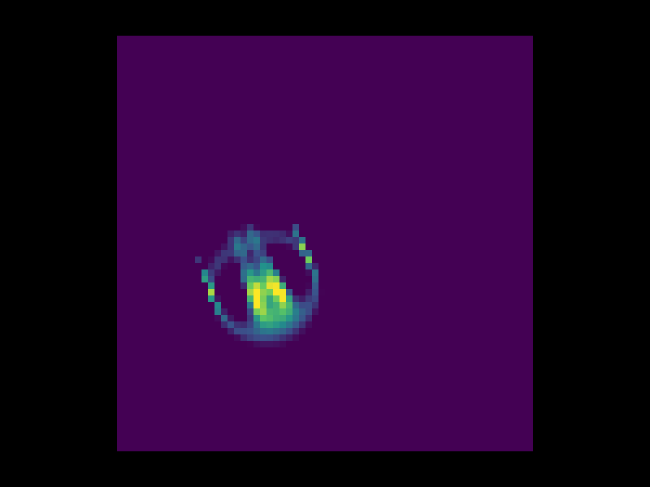
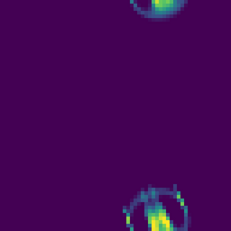
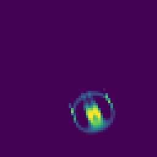
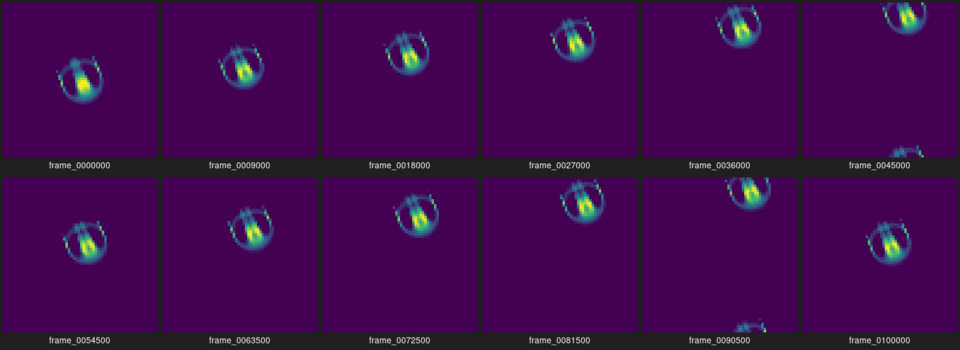
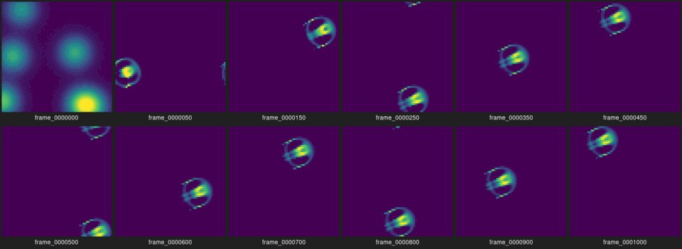
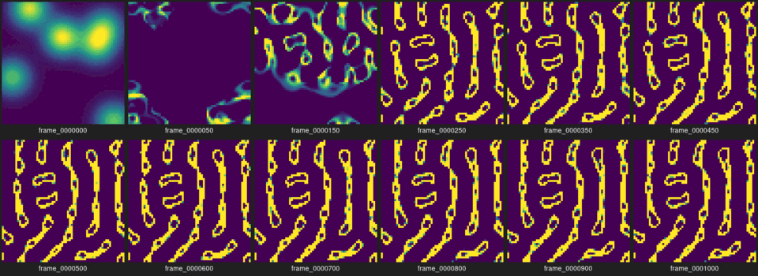

# Phase 1 — 実験レポート

**読者:** 本人(制作者)。
**役割:** Phase 1 の完了報告。本人がこれを読み、Phase 2 に進むか、Phase 1 を続けるか、保留するかを判断する。様式は [.claude/skills/phase-report/SKILL.md](../../.claude/skills/phase-report/SKILL.md)。
**日付:** 2026-09-24

## 1. 実行方法

- 環境: Ubuntu 24.04 (exe.dev VM, x86_64, 2 コア)、g++ 13.3.0、CMake 3.28.3。窓アプリの検証に Xvfb、x11-utils(`xwininfo`)、ImageMagick(`import`)。
- ブランチ `phase-1-autonomous-body`。実験時のコミット **7255598**(全 `config.json` の `code_version`)。
- ビルドとテスト:

```bash
cmake -S . -B build -DCMAKE_BUILD_TYPE=Release && cmake --build build -j
(cd build && ctest --output-on-failure)   # 7/7 passed
cmake -S . -B build-sdl -DCMAKE_BUILD_TYPE=Release -DCAVE_WITH_SDL3=ON && cmake --build build-sdl -j --target cave_window
```

- 実験の再現(全コマンドは付録 A):

```bash
scripts/seed_sweep.sh 20 1000 experiments/out/sweep
./build/cave --model lenia --preset orbium --init orbium --width 64 --height 64 --steps 100000 --every 500 --out experiments/out/P4_orbium_64_100k
xvfb-run -a -s "-screen 0 800x600x24" ./build-sdl/cave_window --frames 420 --keys "90:space,120:n,150:space,240:r,300:s,410:q"
```

## 2. 変更範囲

| ファイル | 内容 |
| --- | --- |
| `src/core/metrics.*` | `compute_shape`(重心・広がり・連結成分数)、`compute_centroid`(毎ステップ用)、`displacement`(周期境界の最小像変位) |
| `src/app/main.cpp` | `metrics.csv` に `cx, cy, spread, components, speed` を追加。速度は毎ステップの重心追跡から経路長で算出。`summary.txt` に平均速度など |
| `src/app/window_main.cpp` | SDL3 窓アプリ `cave_window`。固定時間刻みと描画の分離、キー操作、スクリーンショット、自動検証用の `--frames` / `--keys` / `--shot-every` |
| `CMakeLists.txt` | オプション `CAVE_WITH_SDL3`。SDL3 がなければ release-3.4.16 を取得して静的ビルド(video のみ) |
| `scripts/seed_sweep.sh` | `blobs` 初期化を seed 1..N で走らせ、判定して集計 |
| `tests/test_shape.cpp` | 継ぎ目をまたぐ塊の重心と連結、固定境界との違い、空の格子、`compute_centroid` の一致 |
| `docs/decisions/0003_*` | SDL3 を FetchContent で入れ、仮想ディスプレイで検証する方針と記録 |

フェーズ文書 [01_autonomous_body.md](01_autonomous_body.md) の実装範囲 1〜5 はすべて実装した。**実機(Windows / Mac)での窓表示は未確認**。VM の仮想ディスプレイでのみ検証した。

## 3. 観察結果

### 3.1 窓アプリ(仮想ディスプレイ)



800×600 の仮想画面に 512×512 の窓(64×64 を 8 倍)が開き、Orbium が描画された。起動時の出力は `SDL 3.4.16  video driver: x11  renderer: opengl`。`xwininfo` の窓一覧にタイトル `cave  RUN  step 120  t=12.0  60 steps/s  mass 71.4  comp 2` で現れた。

| 停止中(step 50、継ぎ目をまたぐ) | リセット直後(step 23) |
| --- | --- |
|  |  |

キー注入 `90:space,120:n,121:n,122:n,150:space,240:r,300:s,330:plus,360:minus,410:q` で、停止 → 1 ステップ ×3(step 50→53) → 再開 → リセット(step が 0 から再開) → スクリーンショット保存 → 速度 240 → 120 steps/s → 終了、の順に動いた。

**固定時間刻みの分離:** Xvfb には vsync がなく描画は約 300 fps だったが、シミュレーションは指定どおり 60 steps/s で進んだ(2 秒ごとの報告で step 120, 240, 360, ...)。

### 3.2 長時間観察(Orbium、周期境界)

| run | 格子 | ステップ | t | 総量の範囲 | 速度の範囲 | 連結成分 | 結果 |
| --- | --- | --- | --- | --- | --- | --- | --- |
| P1 | 64×64 | 20000 | 2000 | 70.77〜71.60 | 6.10〜6.16 | 1〜4 | 持続 |
| P2 | 96×96 | 20000 | 2000 | 70.77〜71.60 | 6.10〜6.16 | 1〜4 | 持続 |
| P3 | 128×128 | 20000 | 2000 | 70.77〜71.60 | 6.10〜6.16 | 1〜4 | 持続 |
| P4 | 64×64 | 100000 | 10000 | 70.77〜71.60 | 6.14〜6.15 | 1〜3 | 持続 |



- 4 本とも、消滅・静止・全面飽和・数値異常なし。総量は初期値 76.9 から 20 ステップで 71 付近に落ち着き、以後 t=10000 まで 70.8〜71.6 の範囲で振動し続けた。広がり(RMS 半径)は 5.61〜5.92 セル。
- **P1・P2・P3 は同じステップで指標が一致した**(小数第 3 位まで同じ)。周期境界でカーネル半径 13 が格子の半分より小さいため、個体は自分の像と干渉せず、格子サイズは動きに影響しない。格子を大きくする意味は「壁を通り抜ける頻度」と「表示の余白」だけだった。
- 速度は 6.15 セル/単位時間で一定。方向も一定で、右上へ直進する(シート参照)。P4 のシートでは、100000 ステップの間にほぼ同じ形が周期的に同じ位置に戻っている。
- 連結成分数(閾値 0.1)は 1 個体でも 1〜4 に揺れる。尾の薄い部分が閾値付近で切れたり繋がったりするため。「1 個体」の判定には総量と広がりのほうが安定している。

### 3.3 自発生成の頻度(`blobs` 初期化、64×64、1000 ステップ)

判定ルール(明示): 総量 60〜85、広がり 8 未満、速度 1 以上を「Orbium 型」。総量 0.001 未満を「消滅」。それ以外を「その他」。

| 判定 | seed | 件数 |
| --- | --- | --- |
| Orbium 型 | 2, 11 | **2 / 20** |
| 消滅 | 1, 3, 4, 7〜10, 12〜20 | 16 / 20 |
| その他 | 5, 6 | 2 / 20 |

seed 11(Orbium 型):


seed 5(その他: 値 1 に張り付いた帯状の構造が全面に残り、ゆっくり動く。総量 880、連結成分 15、速度 0.27):


Orbium 型になった 2 例は、総量 71.5、広がり 5.65、速度 6.13 と、Orbium 配置から始めた場合と同じ値に収束した。「その他」の 2 例は、初期の総量が大きい(1044, 796)側で起きたが、seed 2 も初期総量 1051 で Orbium 型になっており、初期総量だけでは決まらない。

## 4. 数値記録

指標は [02_experiment_protocol.md](../02_experiment_protocol.md) に Phase 1 で追加した重心・広がり・連結成分数・速度を加えたもの。閾値は全 run で 0.1。

**再現性:** seed 調査を 2 回走らせ(コミット 744819d と 7255598)、判定結果と総量が一致した。P1〜P3 の指標が格子サイズによらず一致したことも、計算が決定的である傍証になる。

**速度指標の不具合と修正:** 最初の実装はスナップショット間の重心変位から速度を出していたが、間隔 100 ステップでは Orbium が 61 セル進み、周期境界の最小像変位(上限 32)で折り返されて 2.46 と過小評価された(96 格子では 4.57)。毎ステップ重心を追跡して経路長を積算する方式に変え、6.15 になった。修正前の run は破棄して再実行した。

**計算時間(Release、1 コア、-every 100 で毎ステップの重心計算を含む):**

| run | 格子 | ms/step | 備考 |
| --- | --- | --- | --- |
| P1 | 64×64 | 2.54 | Phase 0 の 2.7 と同程度。重心追跡の追加コストは小さい |
| P2 | 96×96 | 5.65 | |
| P3 | 128×128 | 10.01 | 60 steps/s なら 1 秒に 0.60 秒分の計算。リアルタイムの上限付近 |
| P4 | 64×64 | 2.50 | 100000 ステップで 250 秒 |

## 5. 問題

- **実機の窓は未確認。** Windows / Mac での FetchContent ビルドと表示は本人の確認待ち。
- **Xvfb では vsync がない**ので描画が約 300 fps になり、CPU を使い切る。実機では SDL の既定で vsync が効く見込みだが未確認。必要なら `SDL_SetRenderVSync` を足す。
- **連結成分数は閾値 0.1 では不安定**(上記)。閾値を上げるか、判定には使わないか、Phase 2 で決める。
- **自発生成は 20 通りで 2 例(10%)。** ランダム初期化を作品の開始状態にするには低い。Orbium 配置から始めるのが現実的。
- **格子サイズは動きに影響しない**ので、「表示に適した解像度」は計算時間と見た目だけで決めてよい。
- Phase 0 の CLI(`cave`)の速度列は、`--every` が大きくても正しくなったが、Phase 0 の run には速度列がない(当時は未実装)。

## 6. C++ の学習ポイント

- **周期境界の重心:** [metrics.cpp](../../src/core/metrics.cpp) の `compute_centroid` は、各軸の座標を角度 `2π x / W` に写して `sin`/`cos` の重み付き和を取り、`atan2` で戻す(円平均)。継ぎ目をまたぐ塊でも重心が塊の上に来る。固定境界では普通の重み付き平均。テストは継ぎ目をまたぐ 2 セルで両方の挙動を確認している。
- **最小像変位:** `displacement` は差を `[-W/2, W/2)` に折り返す。これが「スナップショット間隔 × 速度 < W/2」という前提を持つことを、実際に速度が過小評価される形で学んだ。標本化の間隔が現象より粗いと折り返しが起きる。
- **連結成分:** `std::queue<std::pair<int,int>>` で幅優先探索。訪問済みは `std::vector<unsigned char>`。周期境界では近傍座標を `Grid::wrap` で回す。構造化束縛 `auto [x, y] = q.front()` は C++17。
- **固定時間刻みと描画の分離:** [window_main.cpp](../../src/app/window_main.cpp) は、フレーム間の実時間を `accumulator` に足し、`1 / sps` を超えた分だけ `step()` を回す。1 フレームの上限(64 ステップ)を超えたら残りを捨てる。これで描画が速くても遅くても、シミュレーションの進みは実時間に対して一定になる。
- **イベント注入で自動検証:** `SDL_PushEvent` で `SDL_EVENT_KEY_DOWN` を積むと、実際のキー入力と同じ `handle_key` を通る。UI の自動テストを、UI 自体に手を入れずに行える。
- **静的リンクと FetchContent:** `SDL_STATIC ON` で `SDL3::SDL3` が静的ライブラリになり、実行ファイル 1 つ(3.7 MB)で配れる。サブシステムを OFF にするとビルドが短くなる。
- **毎ステップの追加計算のコスト:** 重心計算は O(W·H)、Lenia の畳み込みは O(W·H·729)。前者を毎ステップ足しても ms/step はほぼ変わらなかった(2.7 → 2.54)。計算量の見積もりが実測と合った例。

## 7. 次段階の候補と、本人に判断してほしい論点

**Phase 2(音への即時応答)の「刺激の入り口」候補**。観察に基づく提案で、数値は固定しない。

1. **成長関数への加算(空間場)。** `A' = clip(A + dt·(G(U) + S(x, t)))` の形で、刺激 S を場として足す。無音なら S=0 で Phase 1 と同一。局所的に足せば「音が当たった側」が変形する可能性がある。もっとも単純で、Phase 1 との比較が明快。
2. **mu(成長の中心)の変調。** Orbium は mu=0.15 に強く依存する(sigma=0.015 と狭い)。音量で mu を ±数 % 動かすと、速度や形が変わるか、あるいは消滅するかを見る。可塑性(Phase 4)で「感受性」を係数にするなら、この経路が自然。
3. **dt(T)の変調。** dt=0.5 で消滅したので、音で dt を上げるのは「刺激が強すぎると死ぬ」表現になり得るが、安全域が狭い。

**判断してほしいこと:**

1. Phase 2 は上の 1 と 2 のどちらから始めるか。両方を実装して比較するか。
2. 作品の開始状態は Orbium 配置に固定してよいか(ランダム生成は 10%)。
3. 表示の解像度。動きは格子サイズに依らないので、128×128 (10 ms/step、60 steps/s の上限付近) と 64×64 (2.5 ms/step) のどちらを既定にするか。
4. 実機で `cave_window` をビルドして、窓・キー・速度感を確認してほしい。結果(通った/通らない、OS、エラー)を [decisions/0003](../decisions/0003_sdl3_window_fetchcontent.md) に追記する。
5. 連結成分数の閾値をどうするか(0.1 のまま参考値にする、上げる、廃止する)。

## 付録 A: 全実行コマンド

```bash
B=./build/cave; O=experiments/out
scripts/seed_sweep.sh 20 1000 $O/sweep
$B --out $O/P1_orbium_64_20k  --model lenia --preset orbium --init orbium --width 64  --height 64  --steps 20000  --every 100
$B --out $O/P2_orbium_96_20k  --model lenia --preset orbium --init orbium --width 96  --height 96  --steps 20000  --every 100
$B --out $O/P3_orbium_128_20k --model lenia --preset orbium --init orbium --width 128 --height 128 --steps 20000  --every 100
$B --out $O/P4_orbium_64_100k --model lenia --preset orbium --init orbium --width 64  --height 64  --steps 100000 --every 500
for d in $O/P*; do scripts/make_media.sh $d; done
# window app, virtual display
xvfb-run -a -s "-screen 0 800x600x24" bash -c './build-sdl/cave_window --width 64 --height 64 --scale 8 --sps 120 --frames 420 --report 0.5 --shot-every 100 --keys "90:space,120:n,121:n,122:n,150:space,240:r,300:s,330:plus,360:minus,410:q" --shot-dir experiments/out/window'
xvfb-run -a -s "-screen 0 800x600x24" bash -c './build-sdl/cave_window --width 64 --height 64 --scale 8 --sps 60 --frames 4000 & sleep 4; xwininfo -root -tree | grep cave; import -window root experiments/out/window/x11_root_capture.png; wait'
```
