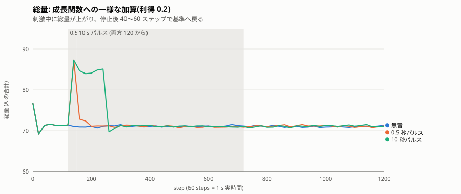
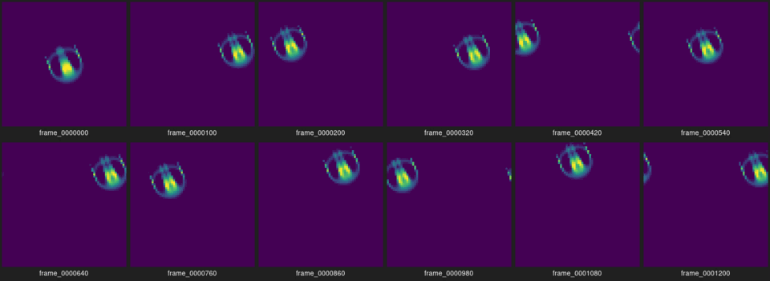
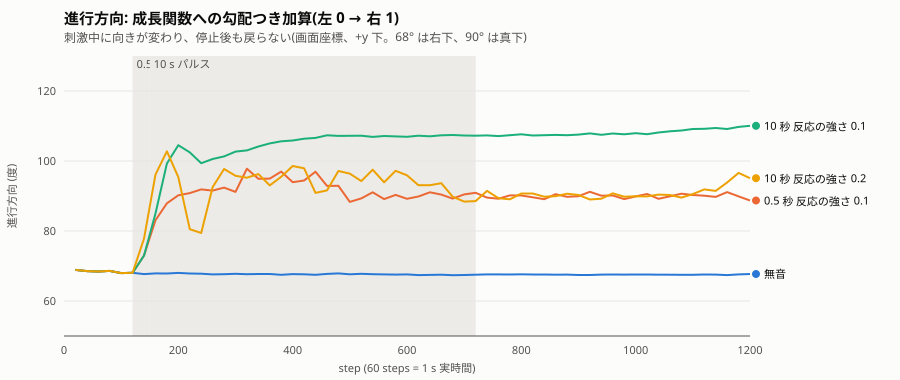
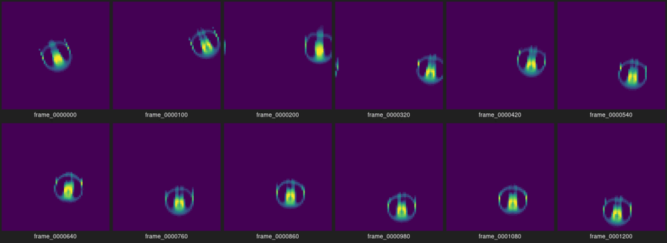
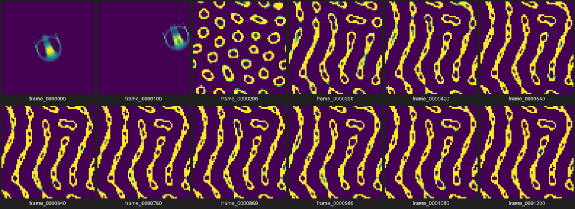
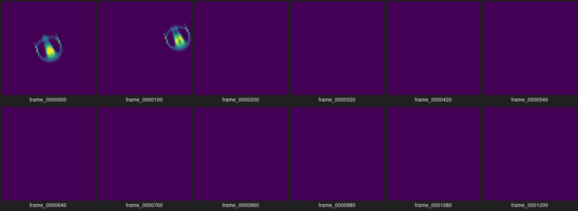
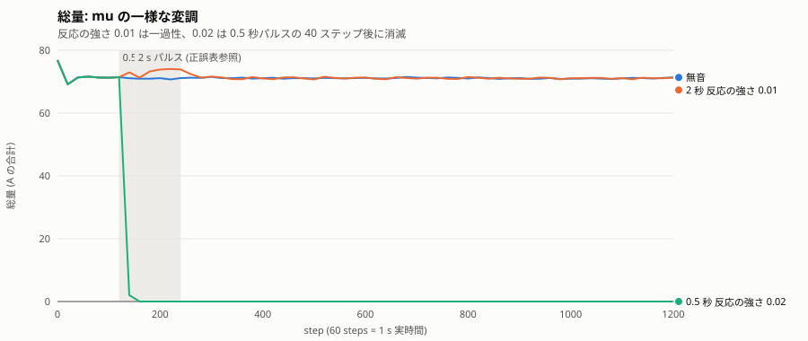

# Phase 2 — 実験レポート

**読者:** 本人(制作者)。
**役割:** Phase 2 の完了報告。本人がこれを読み、Phase 3 に進むか、Phase 2 を続けるか、保留するかを判断する。様式は [.claude/skills/phase-report/SKILL.md](../../.claude/skills/phase-report/SKILL.md)。
**日付:** 2026-09-24

## 1. 実行方法

- 環境: Ubuntu 24.04 (exe.dev VM, x86_64, 2 コア)、g++ 13.3.0、CMake 3.28.3、ffmpeg 6.1.1。窓アプリの検証に Xvfb と SDL の dummy 音声ドライバ。
- ブランチ `phase-2-sound-response`。実験時のコミット **562da9e**(全 `config.json` の `code_version`)。窓アプリの音声再生は 6bf6123。
- ビルドとテスト:

```bash
cmake -S . -B build -DCMAKE_BUILD_TYPE=Release && cmake --build build -j
(cd build && ctest --output-on-failure)   # 9/9 passed
cmake -S . -B build-sdl -DCMAKE_BUILD_TYPE=Release -DCAVE_WITH_SDL3=ON && cmake --build build-sdl -j --target cave_window
```

- 実験の再現(50 run):

```bash
python3 scripts/gen_test_wav.py experiments/audio
scripts/phase2_matrix.sh experiments/out/phase2      # 約 4 分
scripts/phase2_summary.py experiments/out/phase2
scripts/compare_runs.py experiments/out/phase2/baseline experiments/out/phase2/short_growth_uniform_g0.2
```

## 2. 変更範囲

| ファイル | 内容 |
| --- | --- |
| `src/core/stimulus.*` | `Stimulus`(振幅 s(t)、空間の形 h(x): 一様 / x 方向の勾配) |
| `src/core/model.hpp` | `Model::step(const Stimulus&)`。引数なしの `step()` は振幅 0 |
| `src/core/lenia.*` | 入り口 `stim_mode` = none / growth / mu と `stim_gain`。振幅 0 では Phase 1 の演算に触れない |
| `src/core/input.*` | `PulseSource`(合成パルス)、`EnvelopeSource`、`rms_envelope`、`smooth_ema`、`normalize_peak` |
| `src/io/wav.*` | RIFF/WAVE 読み込み(PCM 16/24/32、float 32、多 ch は平均)と 16 bit 書き出し |
| `src/app/main.cpp` | `--stim` / `--stim-shape` / `--stim-mode` / `--stim-gain` / `--pulse-*` / `--wav` / `--smooth` / `--sps`。`stimulus.csv`、`heading_deg`、`stim_mean` |
| `src/app/window_main.cpp` | `--wav` で再生し、再生クロック主導で刺激を与える。SDL audio を有効化 |
| `scripts/` | `gen_test_wav.py`、`to_wav.sh`(MP3 → WAV)、`compare_runs.py`、`phase2_matrix.sh`、`phase2_summary.py` |
| `tests/` | `test_stimulus`(振幅 0 のバイト一致ほか)、`test_input`(パルス、WAV 往復、RMS、平滑化、正規化) |
| `docs/decisions/0005` | 刺激の経路、RMS のみ、MP3 は ffmpeg、再生クロック主導 |

フェーズ文書 [02_sound_response.md](02_sound_response.md) の実装範囲 1〜6 はすべて実装した。**実機での音声再生は未確認**(VM には音声デバイスがない)。

## 3. 観察結果

すべて Orbium、64×64、周期境界、時間基準 60 steps/s。パルスは実時間 t=2 s(step 120)から。「短い」は 0.5 s(30 ステップ)、「継続」は 10 s(600 ステップ)。無音の基準 run との差で評価する。

### 3.1 一様な刺激は一過性で、停止後に基準へ戻る



成長関数への一様な加算(利得 0.2)では、刺激が入った瞬間に総量が 71 → 87 に上がり、継続中は 84〜85 で保たれ、停止後 40〜60 ステップ(0.7〜1 秒)で 71 に戻った。速度も +1.5〜1.7 上がって戻る。進行方向は 1° 以内で変わらない。0.5 秒でも 10 秒でも最大偏差は同じ(応答が飽和する)。



### 3.2 勾配の刺激は向きを変え、その変化は刺激後も残る



左 0 → 右 1 の勾配で成長関数に加算すると、個体は刺激中に向きを変えた(基準 68° = 右下 → 90〜110° = ほぼ真下)。**刺激を止めても向きは戻らない。** 総量と広がりは基準に戻るのに、向きだけが残る。



これは「履歴」の機構を何も入れていないのに、刺激後に持続する差が生まれた例。理由は、Orbium にとって進行方向は「どの向きでも同じ状態」であり、元に戻す力が働かないから(向きは中立安定)。Phase 3〜4 で「記憶」を論じるとき、この種の持続と区別する必要がある。

### 3.3 利得の境界: 効果なし / 見える変化 / 破綻

| 入り口 | 形 | 効果なし〜小 | 見える変化、回復あり | 破綻 |
| --- | --- | --- | --- | --- |
| growth | 一様 | 0.05(総量 +3.6) | 0.1〜0.2(+7〜+16、40〜60 ステップで回復) | ≥0.5: 個体が消え、格子全体が帯状の飽和模様になる(総量 800 超) |
| growth | 勾配 | 0.05(向き +6°) | 0.1(向き +15〜36°、戻らない) | 0.2 の短いパルス: 変形の後 90 ステップで消滅。継続は生存。≥0.5: 飽和 |
| mu | 一様 | 0.005(総量 +1) | 0.01(+3、40 ステップで回復) | ≥0.02: 20〜40 ステップで消滅 |
| mu | 勾配 | 0.005(向き +8〜38°、戻らない) | — | ≥0.01: 消滅 |





mu の許容幅は狭い。mu=0.15、sigma=0.015 なので、+0.02 で成長のピークが個体の実効的な密度から外れる。growth の加算は G ∈ [−1, 1] に対する加算なので、0.2 までは「少し太る」、0.5 で「どこでも成長する」に変わる。

### 3.4 WAV(生成音源、8 秒 + 無音 4 秒)

| run | 入り口 / 形 / 利得 | 総量の最大偏差 | 向きの最大偏差 | 回復 |
| --- | --- | --- | --- | --- |
| kick120(120 BPM の減衰パルス) | growth / 一様 / 0.2 | +3.1 | 2° | 20 ステップ |
| kick120 | growth / 勾配 / 0.2 | +1.8 | 4° | 20 ステップ |
| kick120 | mu / 一様 / 0.01 | +1.5 | 1° | 20 ステップ |
| kick120 | mu / 勾配 / 0.01 | +0.8 | 4° | 40 ステップ |
| tone(220 Hz、1〜5 秒) | growth / 一様 / 0.2 | +14.7 | 2° | 20 ステップ |
| tone | growth / 勾配 / 0.2 | +11.8 | 38° | 向きは戻らない |
| tone | mu / 一様 / 0.01 | +2.9 | 1° | 20 ステップ |
| tone | mu / 勾配 / 0.01 | — | — | 音の停止 40 ステップ後に消滅 |

キックは RMS の包絡が短い(1 拍 0.5 秒のうち立ち上がりだけ)ので、個体は拍ごとに小さく脈打つ程度。持続音は継続パルスと同じ挙動。RMS はファイル内の最大値で正規化しているので、静かな曲でも最大音量の瞬間が 1.0 になる。

### 3.5 窓アプリの WAV 再生(仮想ディスプレイ + dummy 音声)

`--wav kick120.wav --stim-mode growth --stim-gain 0.2` で起動し、`audio driver: dummy` と出た。再生クロック主導で 60 steps/s で進み(1 秒ごとの報告で step 61, 121, 181)、Space で step が止まり(207 で停止)、再開で続き、R で 0 から再生し直した。タイトルバーに現在の刺激振幅が出る。**実機での音の再生と同期は本人の確認待ち。**

## 4. 数値記録

指標は Phase 1 までのものに `heading_deg`(画面座標、+x 右、+y 下)と `stim_mean`(区間平均の刺激振幅)を追加。閾値 0.1。`stimulus.csv` に毎ステップの生振幅と平滑化後の振幅。全 50 run の集計は `scripts/phase2_summary.py` の出力(付録 A)。

**再現性:** 振幅 0 の run は Phase 1 のコードとバイト単位で一致することをテストで保証(`test_stimulus`)。同じ入り口・形・利得で短い/継続パルスの刺激中の最大偏差が一致した(応答が決定的で飽和する)。

**回復の判定:** 最後の刺激の後、総量の差 < 0.5 かつ向きの差 < 2° になった最初のスナップショットまでのステップ数。向きが変わった run は「戻らない」。

## 5. 問題

- **実機の音声は未確認。** VM は dummy ドライバ。Mac で `cave_window --wav` を起動し、音と動きの同期を見てほしい。
- **勾配の継ぎ目。** `h = x/(W−1)` は周期境界の右端 → 左端で 1 → 0 に跳ぶ。個体が継ぎ目を通るたびに刺激が不連続になる。今回の観察でも、勾配 run の向きの変化は個体の位置に依存している可能性がある(未分離)。周期境界に合う形(cos など)は Phase 3 の検討事項。
- **向きの持続は「記憶」ではない。** 3.2 のとおり。Phase 3〜4 の指標設計で、位置・向きのような中立安定な自由度を除いて評価する必要がある。
- **mu の許容幅が狭い**(0.01 と 0.02 の間に生死の境界)。作品で mu を使うなら利得を 0.01 以下に固定するか、Phase 4 の可塑性で感受性を下げる方向が現実的。
- **RMS の正規化はファイル単位。** リアルタイム入力(マイク)では最大値が事前に分からない。Phase 2 の範囲外だが、後で自動利得を考える。
- **短い勾配パルス 0.2 が遅れて消滅した。** 刺激中は生存し、停止 90 ステップ後に死んだ。刺激で崩れた形が自力で戻れなかった例。
- 集計スクリプトの回復判定は向き 2° の閾値に敏感で、`short_growth_gradient_x_g0.05` は 920 ステップと出た(向きが 6° 変わって、ゆっくり基準付近に戻った)。

## 6. C++ の学習ポイント

- **既定引数の代わりのオーバーロード:** [model.hpp](../../src/core/model.hpp) は `step(const Stimulus&)` を純粋仮想にし、引数なしの `step()` を基底で非仮想に定義した。派生クラスで `using Model::step;` を書かないと、派生の `step(const Stimulus&)` が基底の `step()` を隠す(名前隠蔽)。テストで Phase 1 と同一の結果が出ることで、この経路が正しいことを確認した。
- **「触れない」ことの保証:** [lenia.cpp](../../src/core/lenia.cpp) は `drive = gain·s` が 0 のとき元の式に一切分岐しない。浮動小数点で `x + 0.0f` は `x` と同じだが、`mu + 0` の経路を通すより、条件で完全に迂回するほうが意図が明確で、テストもしやすい。
- **RIFF のチャンク走査:** [wav.cpp](../../src/io/wav.cpp) は `fmt ` と `data` 以外のチャンク(`LIST` など)を読み飛ばし、奇数長のチャンクは 1 バイト詰める。エンディアンは手動で組み立て(`le16`/`le32`)、`WAVE_FORMAT_EXTENSIBLE` はサブフォーマットを読む。`std::memcpy` で float を取り出すのは、型を跨ぐ再解釈で未定義動作を避けるため。
- **指数移動平均の時定数:** `alpha = 1 − exp(−1/(tau·rate))`。フレームレートが変わっても tau(秒)の意味が保たれる。
- **音声クロックを主にする:** [window_main.cpp](../../src/app/window_main.cpp) は `SDL_GetAudioStreamQueued` で「まだ再生されていないバイト数」を取り、総量から引いて再生位置を出す。壁時計ではなく、聞こえている音の位置でシミュレーションを進める。
- **仮想関数と `std::unique_ptr<InputSource>`:** パルス源と包絡源を同じ型で扱い、`main.cpp` のループは入力の種類を知らない。

## 7. 次段階の候補と、本人に判断してほしい論点

**Phase 3(履歴)の候補。** 「刺激の移動平均など、時定数の長い内部状態を 1 つ追加」がロードマップの定義。観察から:

1. **刺激の長期平均 m(t)(時定数 数秒〜数十秒)を持ち、それで利得を割る**(順応)。同じ音でも、直前まで大きな音が続いていれば応答が小さくなる。3.1 の「応答が飽和する」性質と組み合わせると、履歴による差が出やすい。
2. **m(t) で mu を少しだけずらす**(利得 0.005 以下の範囲)。長期的な音の多さで個体の「体質」が変わる。ただし mu の許容幅が狭いので、破綻の境界を先に測る必要がある。
3. **向きの持続は履歴の指標から除外する。** 位置と向きは中立安定なので、履歴の効果は総量・広がり・速度・応答の大きさで測る。

**判断してほしいこと:**

1. Phase 3 は上の 1(順応)から始めてよいか。
2. 作品の刺激として、入り口は growth(丈夫だが「太る」応答)と mu(繊細だが許容幅が狭い)のどちらを主にするか。両方残すか。
3. 勾配の形を周期境界に合うもの(cos)に変えるか、勾配自体を作品では使わないか。
4. Mac で `cave_window --wav` を試して、音と動きの同期、体感の応答の強さ(利得 0.1〜0.2)を確認してほしい。Suno の MP3 は `scripts/to_wav.sh` で変換できる。
5. RMS の正規化(ファイル内最大)で問題ないか。曲によって「常に 0.3 前後」のようになる場合、応答が小さくなる。

## 付録 A: 全 50 run の集計(`phase2_summary.py`)

列: 刺激中の |総量差| 最大、|向き差| 最大、広がり差、|速度差| 最大、終了時の総量差、回復ステップ数、終了状態。

```text
run                                          max|dmass| max|dhead| max dspread max|dspeed| final dmass  recover      end
long_growth_gradient_x_g0.05                       2.41       6.37       0.115       0.165      -0.286       40       ok
long_growth_gradient_x_g0.1                        5.93      36.49       0.298       0.577      -0.143        -  not-rec
long_growth_gradient_x_g0.2                       12.92      34.92       0.787       1.323      -0.117        -  not-rec
long_growth_gradient_x_g0.5                      753.92     170.51      20.507      31.737     806.197        -  not-rec
long_growth_gradient_x_g1.0                      800.71     174.91      20.094      17.258     787.873        -  not-rec
long_growth_uniform_g0.05                          3.61       0.40       0.196       0.329      -0.012       40       ok
long_growth_uniform_g0.1                           7.04       0.86       0.372       0.675      -0.359       40       ok
long_growth_uniform_g0.2                          16.20       0.78       0.935       1.697      -0.224       60       ok
long_growth_uniform_g0.5                         736.81     157.31      20.291      28.674     838.199        -  not-rec
long_growth_uniform_g1.0                        1185.18     129.64      18.731       6.157     820.265        -  not-rec
long_mu_gradient_x_g0.005                          1.63      38.33      -0.133       0.894      -0.263        -  not-rec
long_mu_gradient_x_g0.01                          71.14     149.62      -5.631       6.164     -71.351        - EXTINCT@200
long_mu_gradient_x_g0.02                          71.14      68.04      -5.639       6.164     -71.351        - EXTINCT@160
long_mu_gradient_x_g0.05                          71.14     103.64      -5.659       6.164     -71.351        - EXTINCT@140
long_mu_gradient_x_g0.1                           71.14      70.03      -5.659       6.164     -71.351        - EXTINCT@140
long_mu_uniform_g0.005                             1.06       0.80      -0.122       0.243      -0.585       40       ok
long_mu_uniform_g0.01                              3.31       1.50      -0.159       1.051      -0.090       40       ok
long_mu_uniform_g0.02                             71.14     144.62      -5.639       6.164     -71.351        - EXTINCT@160
long_mu_uniform_g0.05                             71.14     166.44      -5.659       6.164     -71.351        - EXTINCT@140
long_mu_uniform_g0.1                              71.14      71.69      -5.659       6.164     -71.351        - EXTINCT@140
short_growth_gradient_x_g0.05                      2.41       6.19       0.115       0.117      -0.362      920       ok
short_growth_gradient_x_g0.1                       5.15      15.19       0.231       0.336       0.368        -  not-rec
short_growth_gradient_x_g0.2                      11.09      26.66       0.640       0.799     -71.351        - EXTINCT@240
short_growth_gradient_x_g0.5                      77.59      21.71       8.998       1.578     -71.351        - EXTINCT@280
short_growth_gradient_x_g1.0                     506.24     127.73      16.461       2.817     819.187        -  not-rec
short_growth_uniform_g0.05                         3.61       0.14       0.163       0.253      -0.614       40       ok
short_growth_uniform_g0.1                          7.04       0.64       0.322       0.468      -0.491       40       ok
short_growth_uniform_g0.2                         16.20       0.84       0.935       1.530      -0.137       40       ok
short_growth_uniform_g0.5                        338.46     130.11      12.485       3.240     815.984        -  not-rec
short_growth_uniform_g1.0                        858.73     121.69      19.889      50.237     799.034        -  not-rec
short_mu_gradient_x_g0.005                         0.71       7.75      -0.120       0.282      -0.030        -  not-rec
short_mu_gradient_x_g0.01                          5.49      96.93       0.448       0.776     -71.351        - EXTINCT@220
short_mu_gradient_x_g0.02                         70.96      39.97      -5.639       5.884     -71.351        - EXTINCT@160
short_mu_gradient_x_g0.05                         71.08     103.64      -5.659       6.157     -71.351        - EXTINCT@140
short_mu_gradient_x_g0.1                          71.08      70.03      -5.659       6.157     -71.351        - EXTINCT@140
short_mu_uniform_g0.005                            0.43       0.01      -0.117       0.314      -0.321       20       ok
short_mu_uniform_g0.01                             1.87       1.41      -0.159       0.722      -0.323       40       ok
short_mu_uniform_g0.02                            70.96     144.62      -5.639       5.863     -71.351        - EXTINCT@160
short_mu_uniform_g0.05                            71.08     166.44      -5.659       6.157     -71.351        - EXTINCT@140
short_mu_uniform_g0.1                             71.08      71.69      -5.659       6.157     -71.351        - EXTINCT@140
wav_kick120_growth_gradient_x_g0.2                 1.78       3.95       0.143       0.466       0.050       20       ok
wav_kick120_growth_uniform_g0.2                    3.05       1.99       0.200       0.633       0.120       20       ok
wav_kick120_mu_gradient_x_g0.01                    0.79       3.52      -0.083       0.314      -0.028       40       ok
wav_kick120_mu_uniform_g0.01                       1.47       1.07      -0.123       1.114      -0.066       20       ok
wav_tone_growth_gradient_x_g0.2                   11.76      38.07       0.731       1.468      -0.248        -  not-rec
wav_tone_growth_uniform_g0.2                      14.65       1.92       0.904       1.635       0.197       20       ok
wav_tone_mu_gradient_x_g0.01                      71.27      67.89      -5.653       6.163     -71.181        - EXTINCT@340
wav_tone_mu_uniform_g0.01                          2.89       1.49      -0.202       0.607      -0.175       20       ok

```

## 付録 B: モデルの式(Phase 2 で追加した項)

- growth: `A' = clip(A + dt·(G(U) + g·s(t)·h(x)), 0, 1)`
- mu: `A' = clip(A + dt·G_{mu + g·s(t)·h(x)}(U), 0, 1)`、`G_m(u) = 2 exp(−(u−m)²/(2σ²)) − 1`
- `s(t)`: パルスなら矩形、WAV なら `clamp(EMA_tau(RMS_{1/60 s}(t)) / max RMS, 0, 1)`
- `h(x)`: 一様 = 1、勾配 = `x/(W−1)`
