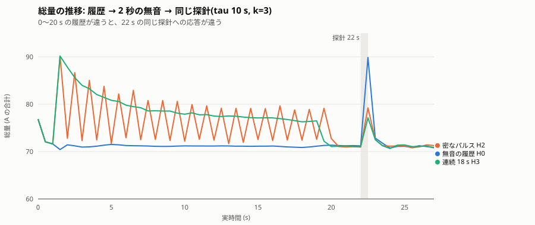
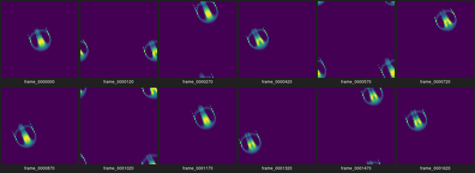
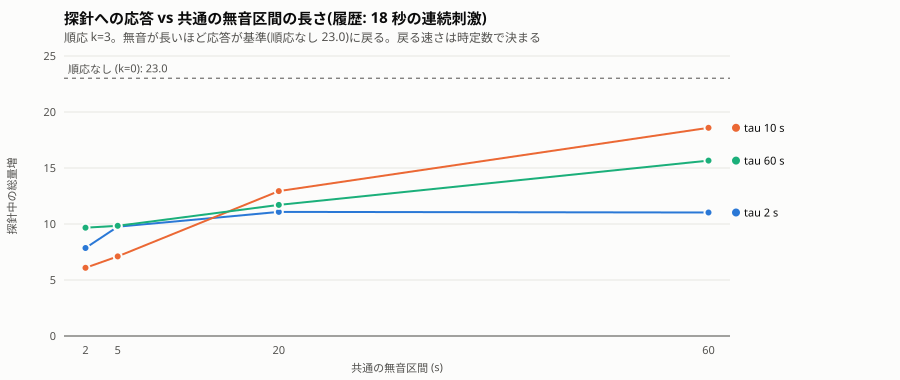
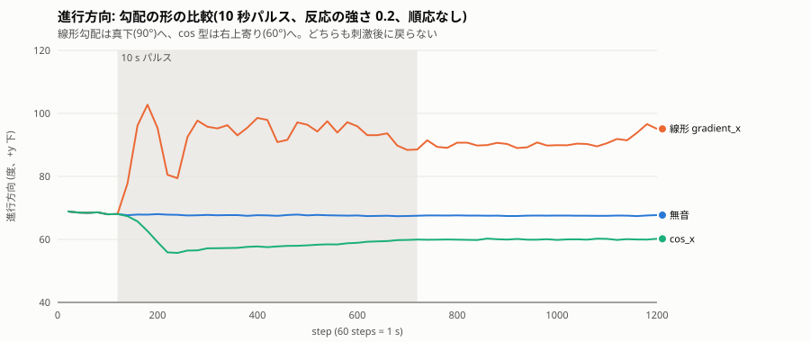
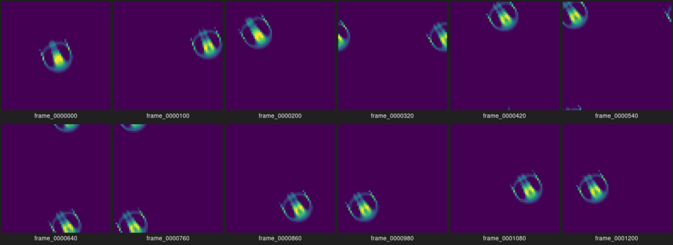

# Phase 3 — 実験レポート

**読者:** 本人(制作者)。
**役割:** Phase 3 の完了報告。本人がこれを読み、Phase 4 に進むか、Phase 3 を続けるか、保留するかを判断する。様式は [.claude/skills/phase-report/SKILL.md](../../.claude/skills/phase-report/SKILL.md)。
**日付:** 2026-09-24

## 1. 実行方法

- 環境: Ubuntu 24.04 (exe.dev VM, x86_64, 2 コア)、g++ 13.3.0、CMake 3.28.3。
- ブランチ `phase-3-history`。実験時のコミット **23153f9**(全 `config.json` の `code_version`)。
- ビルドとテスト:

```bash
cmake -S . -B build -DCMAKE_BUILD_TYPE=Release && cmake --build build -j
(cd build && ctest --output-on-failure)   # 10/10 passed
```

- 実験の再現(59 run、約 10 分):

```bash
scripts/phase3_matrix.sh experiments/out/phase3
scripts/phase3_summary.py experiments/out/phase3
```

## 2. 変更範囲

| ファイル | 内容 |
| --- | --- |
| `src/core/lenia.*` | 遅い状態変数 m(刺激の指数移動平均)、`adapt_k`、`adapt_tau_steps`。`g_eff = g / (1 + k·m)`。m は更新前に読む。チェックポイントに含む |
| `src/core/model.hpp` | `slow_states()`。`metrics.csv` の `adapt_m` 列、`summary.txt`、窓のタイトルに出る |
| `src/core/stimulus.*` | `CosX`: `(1 − cos(2πx/W))/2`、継ぎ目で連続 |
| `src/core/input.*` | `CompositeSource`(複数入力の max)、`EnvelopeSource::truncate` |
| `src/app/main.cpp` | `--probe-at / --probe-dur / --probe-amp`(探針を重ねる)、`--wav-until`、`--adapt-k / --adapt-tau`(秒 → ステップ) |
| `src/app/window_main.cpp` | `--adapt-k / --adapt-tau / --set`、タイトルに m |
| `scripts/phase3_matrix.sh`, `phase3_summary.py` | 履歴 4 × 時定数 3 × 無音 4 + 対照 + k 掃引 + 形の比較。探針応答の集計 |
| `tests/test_adapt.cpp` | k=0 の一致、無刺激で m=0 の一致、EMA の解析値、履歴で応答が小さくなる、往復、合成入力 |
| `docs/decisions/0006` | 順応を履歴の最初の機構にした理由 |

フェーズ文書 [03_history.md](03_history.md) の実装範囲 1〜6 のうち、**実曲での比較(4 の一部)は本人の判断で省略した**(合成パルスで 4 軸 59 通りの確認が取れているため十分、2026-09-24)。手順は README の Phase 3 の節に残してある。

## 3. 観察結果

すべて Orbium、64×64、周期境界、時間基準 60 steps/s、入り口 growth、一様、反応の強さ(コードでは `stim_gain`) 0.3。手順は [02_experiment_protocol.md](../02_experiment_protocol.md) の Phase 3 の定義どおり: 0〜20 s に履歴(H0 無音 / H1 まばら: 0.5 s を 4 s ごとに 5 回 / H2 密: 0.5 s を 1 s ごとに 19 回 / H3 連続: 18 s)、共通の無音(2 / 5 / 20 / 60 s)、その後に同じ探針(0.5 s、振幅 1)。応答 = 探針中の総量の最大値 − 直前の総量。

### 3.1 同じ探針でも、履歴が違えば応答が違う



tau 10 s、無音 2 s: 履歴なし 18.7、まばら 13.7、密 8.3、連続 6.1。**履歴が濃いほど応答が小さい。** 順応なし(k=0)の対照では 4 条件とも 22.3〜23.0 で同じ。つまり差は順応の状態変数 m によるもので、格子の状態そのものは履歴でほとんど変わっていない(探針直前の総量は 4 条件とも 71 前後)。



### 3.2 差が残る時間は時定数で決まる



```text
probe response (mass gain) — rows: history, cols: silence 2/5/20/60 s

  tau 2 s
  hist       2 s     5 s    20 s    60 s    control k=0 (2 s)
  H0       11.20   11.18   10.66   11.29                22.67
  H1       10.20   11.35   11.34   11.04                22.44
  H2        8.51   10.22   10.97   10.71                22.30
  H3        7.86    9.76   11.08   11.03                23.02

  tau 10 s
  hist       2 s     5 s    20 s    60 s    control k=0 (2 s)
  H0       18.65   18.75   18.46   18.34                22.67
  H1       13.74   15.41   17.32   18.83                22.44
  H2        8.28    8.92   15.44   18.50                22.30
  H3        6.09    7.11   12.94   18.59                23.02

  tau 60 s
  hist       2 s     5 s    20 s    60 s    control k=0 (2 s)
  H0       21.83   21.89   21.76   21.64                22.67
  H1       18.50   19.80   20.07   20.86                22.44
  H2       13.29   13.79   15.38   18.31                22.30
  H3        9.67    9.84   11.71   15.66                23.02
```

- **tau 2 s:** 5 s の無音でほぼ消える。ただし履歴なしでも 11.2 と、対照 22.7 の半分しかない。探針そのもの(0.5 s)の間に m が 0.22 まで上がり、探針の後半が削られるため。短い時定数は「履歴」ではなく「即時応答の圧縮」として働く。
- **tau 10 s:** 2〜5 s の無音では差が大きく(6〜9 vs 18.7)、20 s で半分戻り、60 s で消える。
- **tau 60 s:** 60 s の無音の後も連続履歴で 15.7 と、履歴なし 21.6 より 28% 小さい。まばらな履歴でも差が残る。

### 3.3 順応の強さ k

tau 10 s、密な履歴、無音 2 s: k=1 で 14.1、k=3 で 8.3、k=10 で 3.9(履歴なし 18.7)。k は差の大きさを、tau は差の持続を決める。

### 3.4 刺激中の順応(窓アプリでも確認)

連続刺激の間、m が上がるにつれて総量が下がる。窓アプリ(仮想ディスプレイ、tone.wav、k=3、tau 2 s)で、m 0.37 → 0.85 に対して総量 80.4 → 76.7 と、同じ音への応答が小さくなるのを確認した。

### 3.5 勾配の形: 線形と cos



線形勾配(左 0 → 右 1)は向きを 68° → 90〜99°(真下)へ、cos 型(継ぎ目 0、中央 1)は 68° → 58〜60°(右上寄り)へ変えた。**Phase 2 で見た「真下に寄る」は線形勾配に固有で、勾配一般の性質ではない。** cos 型は変化が小さく、すぐ安定した。どちらも刺激後に戻らない(向きは中立安定、Phase 2 のとおり)。



## 4. 数値記録

指標は Phase 2 までのものに `adapt_m` を追加。閾値 0.1。全 run の集計は付録 A。

**再現性:** `adapt_k = 0` の run は Phase 2 とバイト一致(テスト)。順応なしの対照 4 本が同じ応答(22.3〜23.0)を返したことは、履歴の違いが格子状態にはほぼ残らないことも示す。

**集計の不具合と修正:** 集計スクリプトが探針を「period=0 count=1 のパルス」の最初の一致で探していたため、連続履歴 H3(同じ形の 18 s パルス)では履歴を探針と誤認し、m=0・応答一定と出た。最後の一致(探針は最後に重ねる)に直して再集計した。run 自体はやり直していない。

## 5. 問題

- **実曲での比較は省略**(本人の判断)。必要になれば README の手順で取れる。
- **短い時定数は即時応答を削る。** tau 2 s では探針中に順応が進む。作品で「慣れ」を出すなら tau は探針(音の 1 打)より十分長く、10 s 以上が目安。
- **履歴は格子に残らない。** 順応なしなら履歴の差は 0。この履歴は m という 1 つの数に入っているだけで、個体の形や動きには残っていない。Phase 4 で係数を更新しても、同じ構造(状態が格子の外にある)になる点に注意。
- **向きの持続は依然として履歴とは別。** 指標からは除外している。
- 集計は 1 秒窓の最大値なので、応答の「形」(立ち上がり・減衰)は見ていない。必要なら時系列を見る。

## 6. C++ の学習ポイント

- **状態変数の読む順序:** [lenia.cpp](../../src/core/lenia.cpp) は `g_eff` を計算してから m を更新する。逆にすると「今の音」が「今の応答」を削ることになり、履歴の定義と食い違う。1 行の順序が意味を決める例。
- **時定数の単位:** モデルはステップで持ち(`adapt_tau_steps`)、CLI は秒で受けて `tau × steps/s` で換算する。モデルが実時間を知らないままにするための境界。
- **`k = 0` の分岐:** `if (adapt_k > 0)` で完全に迂回し、Phase 2 の演算に触れない。`gain / (1 + 0·m)` でも値は同じだが、意図をコードに書く。
- **チェックポイントの拡張:** `save_state` / `load_state` に m を足した。古い `state.bin`(Phase 2 以前)は読めなくなる。形式に版を入れていないので、必要になった時点で定義する([01_architecture.md](../01_architecture.md) の方針どおり、まだ入れない)。
- **max による合成:** `CompositeSource` は入力の max を返す。履歴と探針が重なったとき、加算より max のほうが「探針の振幅 1」を保てる。
- **正規表現の最初の一致:** 集計の不具合(4 節)。データの形が同じ 2 つの要素を区別するには、順序(最後に重ねたものが探針)という規約に依存していることを明示する必要があった。

## 7. 次段階の候補と、本人に判断してほしい論点

**Phase 4(可塑性)の候補。**

個体は、プログラムの中で決めた数字に従って動いている。関係する数字は 3 つ。

- **音への敏感さ(反応の強さ g)。** いまは 0.3 に固定。大きくすると音でよく反応し、小さくすると鈍くなる。
- **どのくらい丈夫か(sigma)。** いまは 0.015 に固定。小さいほど、少しの乱れで消滅しやすい。
- **体の濃さの基準(mu)。** いまは 0.15 に固定。Phase 2 で 0.02 動かしただけで個体は消滅した。

Phase 3 では、敏感さの数字は 0.3 のままにして、うるさいときだけ一時的に反応を弱める仕組み(m)を足した。静かになれば数十秒で元どおり反応する。

Phase 4 では、**敏感さの数字そのものを、個体が動いている間に自分で書き換えるようにする。** 例えば、うるさい環境で長く過ごした個体は 0.3 が 0.2 に下がり、静かな場所に移ってもそのまま。静かな環境で過ごすと 0.4 に上がる。Phase 3 との違いは、変化が元に戻らないこと。

- 丈夫さの数字も同じように書き換える案があるが、どこまで変えると消滅するか分からないので、先にそれを調べる。
- 体の濃さの基準は、少し変えただけで消滅したので、書き換えの対象にしない。

確かめ方: 同じ個体を 2 つ用意し、片方はうるさい環境、片方は静かな環境で 1 分過ごさせる。その後、両方を静かにして、同じ音を 1 回聞かせる。反応の大きさが違ったままなら、経験が残ったと言える。Phase 3 では静かにすれば差が消えたが、Phase 4 では消えないはず、というのが狙い。

**判断してほしいこと:**

1. Phase 4 は 1(反応の強さの更新)から始めてよいか。
2. 作品の時定数を 10 s 程度にするか、60 s のように長くするか。前者は曲の中の盛り上がりで慣れ、後者は曲全体の音量で慣れる。
3. 勾配は cos 型を既定にするか(継ぎ目で連続、向きの変化は穏やか)、線形を残すか。
4. 履歴が格子に残らない(m という 1 つの数にある)ことを、作品の意図として受け入れるか。「身体に残る」ことを求めるなら、Phase 4 で係数を格子上の場にする(空間的な可塑性)という方向になる。

## 付録 A: 全 run の集計(`phase3_summary.py`)

```text
run                           m@probe  response
H0_tau10_s2                     0.000     18.65
H0_tau10_s20                    0.000     18.46
H0_tau10_s5                     0.000     18.75
H0_tau10_s60                    0.000     18.34
H0_tau2_s2                      0.000     11.20
H0_tau2_s20                     0.000     10.66
H0_tau2_s5                      0.000     11.18
H0_tau2_s60                     0.000     11.29
H0_tau60_s2                     0.000     21.83
H0_tau60_s20                    0.000     21.76
H0_tau60_s5                     0.000     21.89
H0_tau60_s60                    0.000     21.64
H1_tau10_s2                     0.082     13.74
H1_tau10_s20                    0.013     17.32
H1_tau10_s5                     0.060     15.41
H1_tau10_s60                    0.000     18.83
H1_tau2_s2                      0.027     10.20
H1_tau2_s20                     0.000     11.34
H1_tau2_s5                      0.006     11.35
H1_tau2_s60                     0.000     11.04
H1_tau60_s2                     0.034     18.50
H1_tau60_s20                    0.025     20.07
H1_tau60_s5                     0.032     19.80
H1_tau60_s60                    0.013     20.86
H2_tau10_s2                     0.339      8.28
H2_tau10_s20                    0.056     15.44
H2_tau10_s5                     0.251      8.92
H2_tau10_s60                    0.001     18.50
H2_tau2_s2                      0.161      8.51
H2_tau2_s20                     0.000     10.97
H2_tau2_s5                      0.036     10.22
H2_tau2_s60                     0.000     10.71
H2_tau60_s2                     0.131     13.29
H2_tau60_s20                    0.097     15.38
H2_tau60_s5                     0.124     13.79
H2_tau60_s60                    0.050     18.31
H3_tau10_s2                     0.618      6.09
H3_tau10_s20                    0.102     12.94
H3_tau10_s5                     0.458      7.11
H3_tau10_s60                    0.002     18.59
H3_tau2_s2                      0.223      7.86
H3_tau2_s20                     0.000     11.08
H3_tau2_s5                      0.050      9.76
H3_tau2_s60                     0.000     11.03
H3_tau60_s2                     0.247      9.67
H3_tau60_s20                    0.183     11.71
H3_tau60_s5                     0.235      9.84
H3_tau60_s60                    0.094     15.66
control_H0_k0_s2                0.000     22.67
control_H1_k0_s2                0.000     22.44
control_H2_k0_s2                0.000     22.30
control_H3_k0_s2                0.000     23.02
ksweep_H2_tau10_k10_s2          0.339      3.89
ksweep_H2_tau10_k1_s2           0.339     14.07

```
