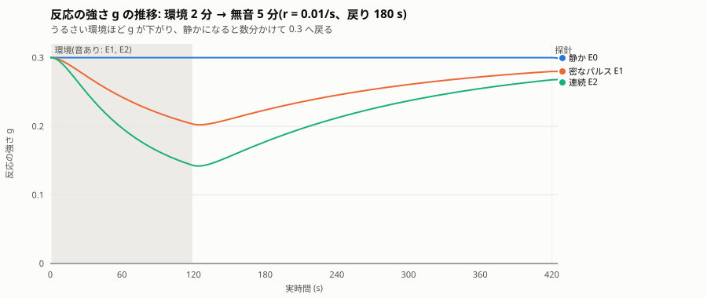
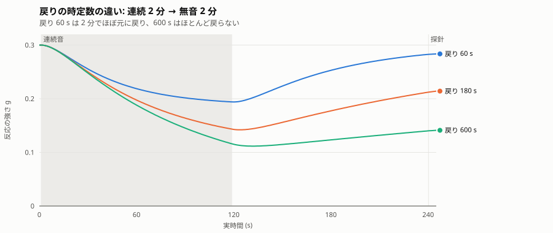
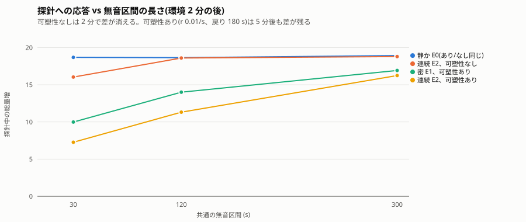

# Phase 4 — 実験レポート

**読者:** 本人(制作者)。
**役割:** Phase 4 の完了報告。本人がこれを読み、Phase 5 以降(任意)に進むか、作品の仕上げに向かうかを判断する。様式は [.claude/skills/phase-report/SKILL.md](../../.claude/skills/phase-report/SKILL.md)。
**日付:** 2026-09-24

## 1. 実行方法

- 環境: Ubuntu 24.04 (exe.dev VM, x86_64, 2 コア)、g++ 13.3.0、CMake 3.28.3。
- ブランチ `phase-4-plasticity`。実験時のコミット **bb39c7b**(全 `config.json` の `code_version`)。
- ビルドとテスト:

```bash
cmake -S . -B build -DCMAKE_BUILD_TYPE=Release && cmake --build build -j
(cd build && ctest --output-on-failure)   # 11/11 passed
```

- 実験の再現(22 run、約 20 分):

```bash
scripts/phase4_matrix.sh experiments/out/phase4_e30
scripts/phase3_summary.py experiments/out/phase4_e30
```

## 2. 変更範囲

| ファイル | 内容 |
| --- | --- |
| `src/core/lenia.*` | 反応の強さ(コードでは `stim_gain`)を遅い状態変数 g に。`plast_rate`、`plast_return_steps`。`g −= r·m·g`、`g += (g0 − g)/τ`、g ≤ g0。r = 0 で Phase 3 とバイト一致。チェックポイントに含む。`slow_states()` に `plast_g` |
| `src/app/main.cpp` | `--plast-rate`(1 秒あたり)、`--plast-return`(秒) |
| `src/app/window_main.cpp` | 同オプション。作品向けの既定を cos 型・順応 k=3・時定数 10 秒に。タイトルに g |
| `src/core/input.*` | **不具合修正:** `--pulse-count 1` のパルスが既定の周期 2 秒で切れていた(下記 5 節) |
| `scripts/phase4_matrix.sh` | 環境 3 × 無音 3 × 可塑性あり/なし + r の掃引 + 戻り時定数の掃引 |
| `tests/test_plastic.cpp`, `test_input.cpp` | r=0 の一致、無刺激で g=g0、うるさい履歴で下がり静けさで戻る、長い無音後も差が残る、往復、パルス長の回帰 |
| `docs/decisions/0007` | 可塑性の設計と作品向け既定値 |

フェーズ文書 [04_plasticity.md](04_plasticity.md) の実装範囲 1〜4 はすべて実装した。

## 3. 観察結果

すべて Orbium、64×64、周期境界、60 steps/s、入り口 growth、一様、反応の強さ 0.3、順応 k=3・時定数 10 秒。手順: 0〜120 s に環境(E0 静か / E1 密なパルス: 0.5 s を 1 s ごとに 118 回 / E2 連続: 118 s)、共通の無音(30 / 120 / 300 s)、同じ探針(0.5 s、振幅 1)。応答 = 探針中の総量の最大値 − 直前の総量。

### 3.1 反応の強さ g は、経験で下がり、静かな時間で数分かけて戻る



r = 0.01/s、戻り 180 s: 密なパルス環境で 2 分後に 0.30 → 0.20、連続音で 0.14。その後の無音 5 分で 0.28 / 0.27 まで戻った。静かな環境では 0.30 のまま(可塑性あり/なしで応答が小数第 2 位まで一致)。



戻り時定数 60 s では無音 2 分でほぼ元に戻り(0.28)、600 s ではほとんど戻らない(0.14)。

### 3.2 経験の差は、静かな時間の後にも残る



探針への応答(静かな環境 E0 では 18.6〜18.9)。

| 無音 | E1 密、可塑性なし | E1 密、あり | E2 連続、なし | E2 連続、あり |
| --- | --- | --- | --- | --- |
| 30 s | 17.8 | **10.0** | 16.0 | **7.3** |
| 120 s | 18.1 | **14.0** | 18.6 | **11.3** |
| 300 s | 19.2 | **16.9** | 18.8 | **16.2** |

- **可塑性なし(順応だけ、Phase 3 と同じ):** 30 s では順応の名残で少し小さいが、2 分以上の無音で差は消える。
- **可塑性あり:** 5 分の無音の後も、連続音の環境で育った個体の応答は静かな環境より 14% 小さい。2 分後で 40% 小さい。差は戻り時定数(180 s)で縮む。
- 応答は探針時の g にほぼ従う(g 0.16 → 7.3、0.21 → 11.3、0.27 → 16.2、0.30 → 18.7)。

### 3.3 r と戻り時定数の効き方(連続音の環境)

| 設定 | 探針時の g | 応答 |
| --- | --- | --- |
| r 0.003/s、戻り 180 s、無音 30 s | 0.24 | 11.5 |
| r 0.01/s、同 | 0.16 | 7.3 |
| r 0.03/s、同 | 0.08 | 3.4 |
| r 0.01/s、戻り 60 s、無音 120 s | 0.28 | 17.2 |
| r 0.01/s、戻り 180 s、同 | 0.21 | 11.3 |
| r 0.01/s、戻り 600 s、同 | 0.14 | 7.2 |

r は「どこまで下がるか」、戻り時定数は「何分残るか」を決める。落ち着き先の式 `g0 / (1 + r·τ·m)` は、連続音(m ≈ 1)で r 0.01、τ 180 なら 0.107。2 分では完全には落ち着かず 0.14 だった。

### 3.4 窓アプリ

`--plast-rate 0.05 --plast-return 60` で持続音を再生し(仮想ディスプレイ、dummy 音声)、タイトルの g が 0.300 → 0.279 と下がり、音が止んでも下がった値から戻り始めるのを確認した。既定値(cos 型、順応 10 秒)で起動できる。

## 4. 数値記録

`metrics.csv` に `plast_g` を追加。`adapt_m` と並んで記録される。全 22 run の集計は付録 A。

**再現性:** `plast_rate = 0` は Phase 3 とバイト一致(テスト)。静かな環境 E0 の可塑性あり/なしで応答が一致(18.64 / 18.64)。

**測定の不備と修正:** 最初のマトリクスはスナップショット間隔 60 ステップで走らせたため、0.5 秒(30 ステップ)の探針の山を取り逃がし、応答が 1〜2 と出た。間隔 30 で走らせ直した(`phase4_e30`)。g の値は間隔に依らず同じ。

## 5. 問題

- **合成パルス源の不具合(Phase 2・3 に影響)。** `--pulse-count 1` でも既定の周期 2 秒でパルスが切れていた。Phase 2 の「10 秒パルス」と Phase 3 の形の比較は実際には 2 秒だった。修正し(bb39c7b)、回帰テストを足し、10 秒で再実験して両報告に正誤表を付けた。一様な刺激の結論は不変。線形勾配 0.2 を 10 秒当てると刺激後に消滅する(安全域は 0.1)。cos 型 0.2 × 10 秒は生存し、向きが刺激後に基準へ戻った。
- **可塑性は「経験が残る」を数字 1 つで表している。** Phase 3 の m と同じく、格子(個体の形や動き)には残らない。作品として「身体に刻まれる」表現が要るなら、格子上の場にする設計が必要(本人の判断で見送り、決定 0007)。
- **鋭敏化は入れていない。** g は g0 を超えない。静かな環境で「敏感になる」方向はない。
- 応答と g の関係はやや非線形(探針そのものの順応が重なるため)。

## 6. C++ の学習ポイント

- **2 つの時定数を持つ状態:** [lenia.cpp](../../src/core/lenia.cpp) では m(秒〜数十秒)と g(分)が同じ `step()` の中で更新される。g の駆動信号に m を使うので、更新の順序(g_eff を読む → g を更新 → m を更新)が意味を決める。
- **上限のクランプ:** `if (g_ > stim_gain) g_ = stim_gain` は、戻りの項が g0 を超えて振れないための保険。数値誤差で 1e-9 超えても意味はないが、意図を明示する。
- **単位の境界:** モデルは「ステップあたり」、CLI は「1 秒あたり」で受けて `/ steps_per_second` で換算する。`--plast-rate 0.01` は 1 ステップあたり 1.67e-4。
- **不具合の見つかり方:** Phase 4 の下ごしらえで 30 秒の連続パルスを流したら m が上がらず、パルス源が周期で切っていると分かった。Phase 2・3 では `stimulus.csv` に「何が入ったか」が正直に記録されていたので、遡って確認できた。記録の設計([02_experiment_protocol.md](../02_experiment_protocol.md))が効いた例。
- **計測の落とし穴:** スナップショット間隔が現象(0.5 秒)より粗いと山を取り逃がす。Phase 1 の速度の折り返しと同じ種類の問題。

## 7. 4 つの性質のまとめと、本人に判断してほしい論点

[00_vision.md](../00_vision.md) の 4 つの性質がどこまで示せたか。

| 性質 | 状態 | 根拠 |
| --- | --- | --- |
| 1 自律運動 | 示せた | Orbium が無音で 100000 ステップ動き続けた(Phase 1) |
| 2 刺激応答 | 示せた | 一様な刺激で膨らみ、勾配で向きが変わる。停止後 1 秒以内に戻る(Phase 2) |
| 3 履歴 | 示せた(数字 1 つで) | 同じ音でも履歴で応答が違う。差は時定数で消える(Phase 3) |
| 4 可塑性 | 示せた(数字 1 つで) | 経験で反応の強さが下がり、5 分後も差が残る。戻り時定数で縮む(Phase 4) |

中心の問い「局所的な更新だけで動く系に刺激履歴と可塑性を加えると、同じ初期条件から経験による持続的な違いが生まれるか」には、**「生まれる。ただし違いは個体全体の 2 つの数(m, g)にあり、個体の形や動きには残らない」**と答えられる。向きの変化は残るが、それは経験ではなく「押された」結果(Phase 2〜3)。

**判断してほしいこと:**

1. ここで Phase 0〜4 の本体を区切りとし、作品の仕上げ(表示の層、既定値の調整、Mac での通し確認)に向かうか。Phase 5(更新則の可変化)、6(個体差の比較)、7(意味入力)は任意。
2. 作品の可塑性の既定値。実験の中では r 0.01/s、戻り 180 s が「曲の中で変わり、曲が終わると数分で戻る」速さ。窓アプリの既定にするか。
3. 「経験が身体に残る」表現を求めるか。求めるなら、次は格子上の場としての可塑性(空間的な g)になる。
4. 鋭敏化(静かな環境で敏感になる)を入れるか。入れるなら上限(0.4 で飽和)の扱いが要る。

## 付録 A: 全 run の集計(`phase3_summary.py experiments/out/phase4_e30`)

```text
run                           m@probe  g@probe  response
off_E0_s120                     0.000   0.3000     18.64
off_E0_s30                      0.000   0.3000     18.69
off_E0_s300                     0.000   0.3000     18.93
off_E1_s120                     0.000   0.3000     18.14
off_E1_s30                      0.022   0.3000     17.83
off_E1_s300                     0.000   0.3000     19.16
off_E2_s120                     0.000   0.3000     18.60
off_E2_s30                      0.045   0.3000     16.03
off_E2_s300                     0.000   0.3000     18.79
on_E0_s120                      0.000   0.3000     18.64
on_E0_s30                       0.000   0.3000     18.68
on_E0_s300                      0.000   0.3000     18.92
on_E1_s120                      0.000   0.2453     14.00
on_E1_s30                       0.022   0.2103      9.98
on_E1_s300                      0.000   0.2799     16.92
on_E2_s120                      0.000   0.2121     11.31
on_E2_s30                       0.045   0.1559      7.27
on_E2_s300                      0.000   0.2677     16.24
rate0.003_E2_s30                0.045   0.2407     11.53
rate0.03_E2_s30                 0.045   0.0773      3.40
return600_E2_s120               0.000   0.1401      7.16
return60_E2_s120                0.000   0.2827     17.16
```
